# TokoKita Pertemuan 5

Pertemuan 5 (Pertemuan 4 ada di README2.MD)

Nama : Fawwaz Afkar Muzakky

NIM : H1D022067

SHIFT Lama: B

Shift Baru: C

# Penjelasan Integrasi API di Flutter App TokoKita

## Proses Login

Proses login ditangani oleh `LoginPage` yang terletak di file `login_page.dart`.

### Langkah-langkah:

1. Pengguna memasukkan email dan password pada form login.
2. Saat tombol "Login" ditekan, metode `_submit()` dipanggil.
3. `LoginBloc.login()` dipanggil dengan email dan password yang dimasukkan.
4. Jika login berhasil (kode 200):
   - Token dan UserID disimpan menggunakan `UserInfo().setToken()` dan `UserInfo().setUserID()`.
   - Pengguna diarahkan ke `ProdukPage`.
5. Jika login gagal, pesan kesalahan ditampilkan menggunakan `WarningDialog`.

### Source Code:

```dart
// login_page.dart

class _LoginPageState extends State<LoginPage> {
  // ... (kode lainnya)

  void _submit() {
    _formKey.currentState!.save();
    setState(() {
      _isLoading = true;
    });
    LoginBloc.login(
            email: _emailTextboxController.text,
            password: _passwordTextboxController.text)
        .then((value) async {
      if (value.code == 200) {
        await UserInfo().setToken(value.token.toString());
        await UserInfo().setUserID(int.parse(value.userID.toString()));
        Navigator.pushReplacement(context,
            MaterialPageRoute(builder: (context) => const ProdukPage()));
      } else {
        showDialog(
          context: context,
          barrierDismissible: false,
          builder: (BuildContext context) => const WarningDialog(
            description: "Login gagal, silahkan coba lagi",
          ),
        );
      }
    }, onError: (error) {
      print(error);
      showDialog(
        context: context,
        barrierDismissible: false,
        builder: (BuildContext context) => const WarningDialog(
          description: "Login gagal, silahkan coba lagi",
        ),
      );
    });
    setState(() {
      _isLoading = false;
    });
  }
}
```

## Proses Registrasi

Proses registrasi ditangani oleh `RegistrasiPage` yang terletak di file `registrasi_page.dart`.

### Langkah-langkah:

1. Pengguna mengisi form registrasi dengan nama, email, password, dan konfirmasi password.
2. Saat tombol "Registrasi" ditekan, metode `_submit()` dipanggil.
3. `RegistrasiBloc.registrasi()` dipanggil dengan data yang dimasukkan.
4. Jika registrasi berhasil, `SuccessDialog` ditampilkan.
5. Jika registrasi gagal, `WarningDialog` ditampilkan.

### Source Code:

```dart
// registrasi_page.dart

class _RegistrasiPageState extends State<RegistrasiPage> {
  // ... (kode lainnya)

  void _submit() {
    _formKey.currentState!.save();
    setState(() {
      _isLoading = true;
    });
    RegistrasiBloc.registrasi(
            nama: _namaTextboxController.text,
            email: _emailTextboxController.text,
            password: _passwordTextboxController.text)
        .then((value) {
      showDialog(
        context: context,
        barrierDismissible: false,
        builder: (BuildContext context) => SuccessDialog(
          description: "Registrasi berhasil, silahkan login",
          okClick: () {
            Navigator.pop(context);
          },
        ),
      );
    }, onError: (error) {
      showDialog(
        context: context,
        barrierDismissible: false,
        builder: (BuildContext context) => const WarningDialog(
          description: "Registrasi gagal, silahkan coba lagi",
        ),
      );
    });
    setState(() {
      _isLoading = false;
    });
  }
}
```

## Menampilkan Daftar Produk

Daftar produk ditampilkan di `ProdukPage` yang terletak di file `produk_page.dart`.

### Langkah-langkah:

1. `ProdukPage` menggunakan `FutureBuilder` untuk memanggil `ProdukBloc.getProduks()`.
2. Daftar produk ditampilkan menggunakan `ListView.builder`.
3. Setiap item produk ditampilkan menggunakan `ItemProduk` widget.

### Source Code:

```dart
// produk_page.dart

class ProdukPage extends StatefulWidget {
  // ... (kode lainnya)

  @override
  Widget build(BuildContext context) {
    return Scaffold(
      appBar: AppBar(
        title: const Text('List Produk Toko Kita - Fawwaz'),
        // ... (kode lainnya)
      ),
      body: FutureBuilder<List>(
        future: ProdukBloc.getProduks(),
        builder: (context, snapshot) {
          if (snapshot.hasError) print(snapshot.error);
          return snapshot.hasData
              ? ListProduk(
                  list: snapshot.data,
                )
              : const Center(
                  child: CircularProgressIndicator(),
                );
        },
      ),
    );
  }
}

class ListProduk extends StatelessWidget {
  final List? list;
  const ListProduk({Key? key, this.list}) : super(key: key);

  @override
  Widget build(BuildContext context) {
    return ListView.builder(
        itemCount: list == null ? 0 : list!.length,
        itemBuilder: (context, i) {
          return ItemProduk(
            produk: list![i],
          );
        });
  }
}
```

## Create Produk

Proses pembuatan produk baru ditangani oleh `ProdukForm` yang terletak di file `produk_form.dart`.

### Langkah-langkah:

1. Pengguna mengakses form tambah produk dari `ProdukPage`.
2. Pengguna mengisi form dengan kode produk, nama produk, dan harga.
3. Saat tombol "SIMPAN" ditekan, metode `simpan()` dipanggil.
4. `ProdukBloc.addProduk()` dipanggil dengan data produk baru.
5. Jika berhasil, pengguna diarahkan kembali ke `ProdukPage`.
6. Jika gagal, `WarningDialog` ditampilkan.

### Source Code:

```dart
// produk_form.dart

class _ProdukFormState extends State<ProdukForm> {
  // ... (kode lainnya)

  simpan() {
    setState(() {
      _isLoading = true;
    });
    Produk createProduk = Produk(id: null);
    createProduk.kodeProduk = _kodeProdukTextboxController.text;
    createProduk.namaProduk = _namaProdukTextboxController.text;
    createProduk.hargaProduk = int.parse(_hargaProdukTextboxController.text);
    ProdukBloc.addProduk(produk: createProduk).then((value) {
      Navigator.of(context).push(MaterialPageRoute(
          builder: (BuildContext context) => const ProdukPage()));
    }, onError: (error) {
      showDialog(
        context: context,
        builder: (BuildContext context) => const WarningDialog(
          description: "Simpan gagal, silahkan coba lagi",
        ),
      );
    });
    setState(() {
      _isLoading = false;
    });
  }
}
```

## Read Produk Detail

Detail produk ditampilkan di `ProdukDetail` yang terletak di file `produk_detail.dart`.

### Langkah-langkah:

1. Pengguna menekan item produk di `ProdukPage`.
2. `ProdukDetail` ditampilkan dengan informasi produk yang dipilih.

### Source Code:

```dart
// produk_detail.dart

class ProdukDetail extends StatefulWidget {
  Produk? produk;
  ProdukDetail({Key? key, this.produk}) : super(key: key);

  @override
  _ProdukDetailState createState() => _ProdukDetailState();
}

class _ProdukDetailState extends State<ProdukDetail> {
  @override
  Widget build(BuildContext context) {
    return Scaffold(
      appBar: AppBar(
        title: const Text('Detail Produk Toko Kita - Fawwaz'), 
      ),
      body: Center(
        child: Column(
          children: [
            Text(
              "Kode : ${widget.produk!.kodeProduk}",
              style: const TextStyle(fontSize: 20.0, fontWeight: FontWeight.bold),
            ),
            Text(
              "Nama : ${widget.produk!.namaProduk}",
              style: const TextStyle(fontSize: 18.0),
            ),
            Text(
              "Harga : Rp. ${widget.produk!.hargaProduk.toString()}",
              style: const TextStyle(fontSize: 18.0),
            ),
            _tombolHapusEdit(),
          ],
        ),
      ),
    );
  }
}
```

## Update Produk

Proses update produk juga ditangani oleh `ProdukForm` yang terletak di file `produk_form.dart`.

### Langkah-langkah:

1. Pengguna menekan tombol "EDIT" di `ProdukDetail`.
2. Form produk ditampilkan dengan data produk yang ada.
3. Pengguna mengubah data produk.
4. Saat tombol "UBAH" ditekan, metode `ubah()` dipanggil.
5. `ProdukBloc.updateProduk()` dipanggil dengan data produk yang diperbarui.
6. Jika berhasil, pengguna diarahkan kembali ke `ProdukPage`.
7. Jika gagal, `WarningDialog` ditampilkan.

### Source Code:

```dart
// produk_form.dart

class _ProdukFormState extends State<ProdukForm> {
  // ... (kode lainnya)

  ubah() {
    setState(() {
      _isLoading = true;
    });
    Produk updateProduk = Produk(id: widget.produk!.id!);
    updateProduk.kodeProduk = _kodeProdukTextboxController.text;
    updateProduk.namaProduk = _namaProdukTextboxController.text;
    updateProduk.hargaProduk = int.parse(_hargaProdukTextboxController.text);
    ProdukBloc.updateProduk(produk: updateProduk).then((value) {
      Navigator.of(context).push(MaterialPageRoute(
          builder: (BuildContext context) => const ProdukPage()));
    }, onError: (error) {
      showDialog(
        context: context,
        builder: (BuildContext context) => const WarningDialog(
          description: "Permintaan ubah data gagal, silahkan coba lagi",
        ),
      );
    });
    setState(() {
      _isLoading = false;
    });
  }
}
```

## Delete Produk

Proses penghapusan produk ditangani di `ProdukDetail` yang terletak di file `produk_detail.dart`.

### Langkah-langkah:

1. Pengguna menekan tombol "DELETE" di `ProdukDetail`.
2. Dialog konfirmasi ditampilkan.
3. Jika pengguna mengonfirmasi, `ProdukBloc.deleteProduk()` dipanggil.
4. Jika berhasil, pengguna diarahkan kembali ke `ProdukPage`.
5. Jika gagal, `WarningDialog` ditampilkan.

### Source Code:

```dart
// produk_detail.dart

class _ProdukDetailState extends State<ProdukDetail> {
  // ... (kode lainnya)

  void confirmHapus() {
    AlertDialog alertDialog = AlertDialog(
      content: const Text("Yakin ingin menghapus data ini?"),
      actions: [
        // Tombol hapus
        TextButton(
          child: const Text("Ya"),
          onPressed: () {
            ProdukBloc.deleteProduk(id: int.parse(widget.produk!.id!)).then(
              (value) => {
                Navigator.of(context).pushReplacement(MaterialPageRoute(
                    builder: (context) => const ProdukPage()))
              },
              onError: (error) {
                showDialog(
                  context: context,
                  builder: (BuildContext context) => const WarningDialog(
                    description: "Hapus gagal, silahkan coba lagi",
                  ),
                );
              },
            );
          },
        ),
        // Tombol batal
        TextButton(
          child: const Text("Batal"),
          onPressed: () => Navigator.pop(context),
        )
      ],
    );
    showDialog(builder: (context) => alertDialog, context: context);
  }
}
```

## Proses Logout

Proses logout ditangani di `ProdukPage` yang terletak di file `produk_page.dart`.

### Langkah-langkah:

1. Pengguna membuka drawer menu dan menekan "Logout".
2. `LogoutBloc.logout()` dipanggil.
3. Pengguna diarahkan kembali ke `LoginPage`.

### Source Code:

```dart
LogoutBloc.logout().then((value) => {
  Navigator.of(context).pushAndRemoveUntil(
      MaterialPageRoute(builder: (context) => LoginPage()),
      (route) => false)
});
```


# Screeenshot
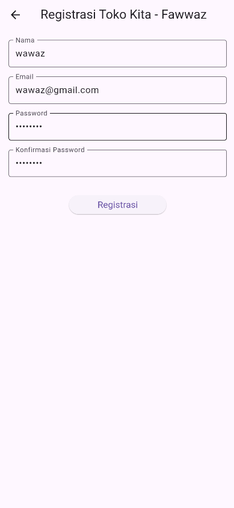
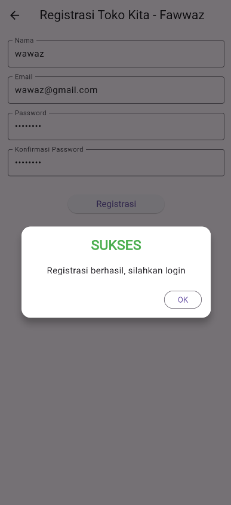
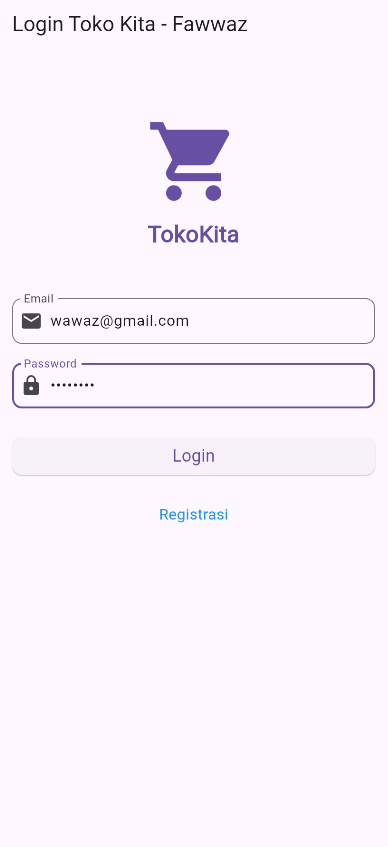
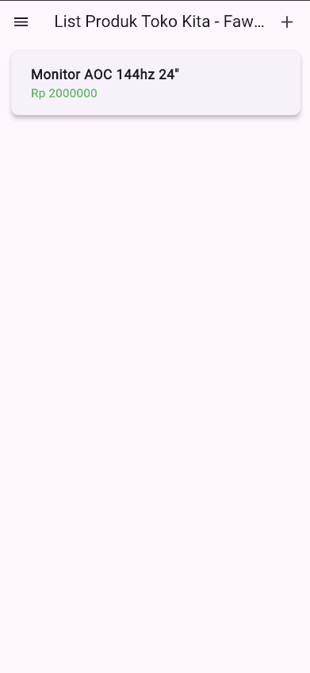
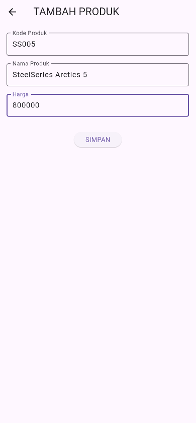
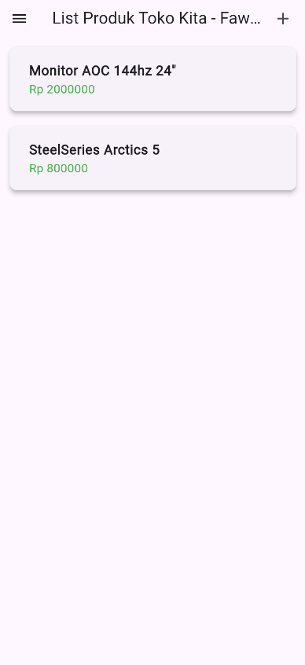
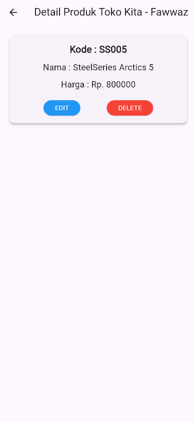
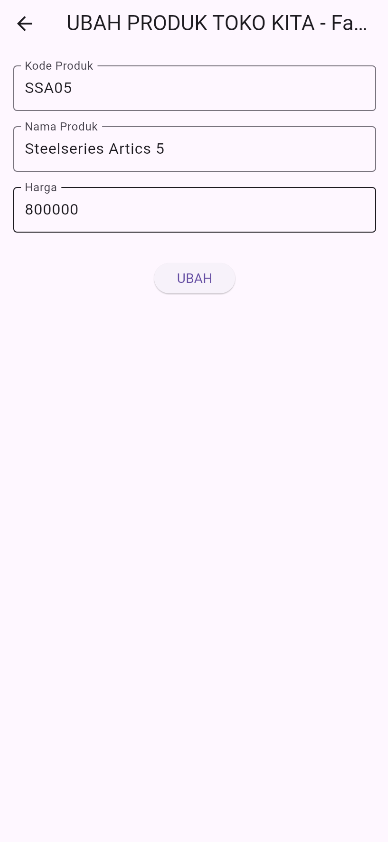
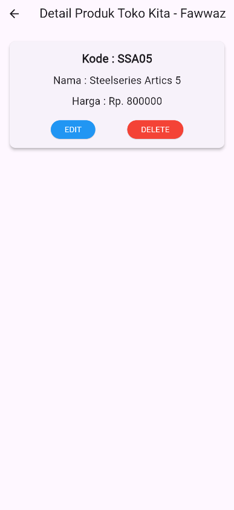
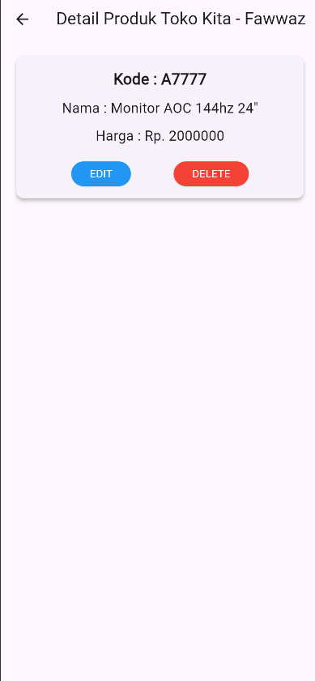
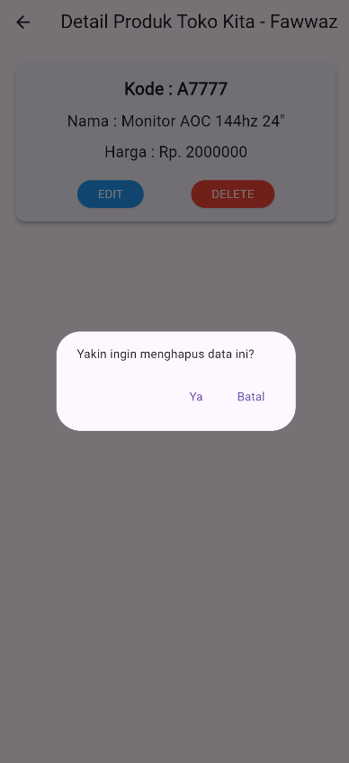
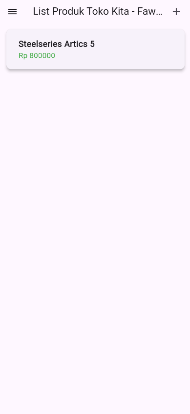
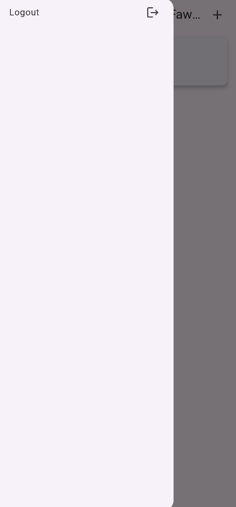

